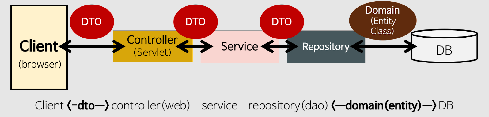
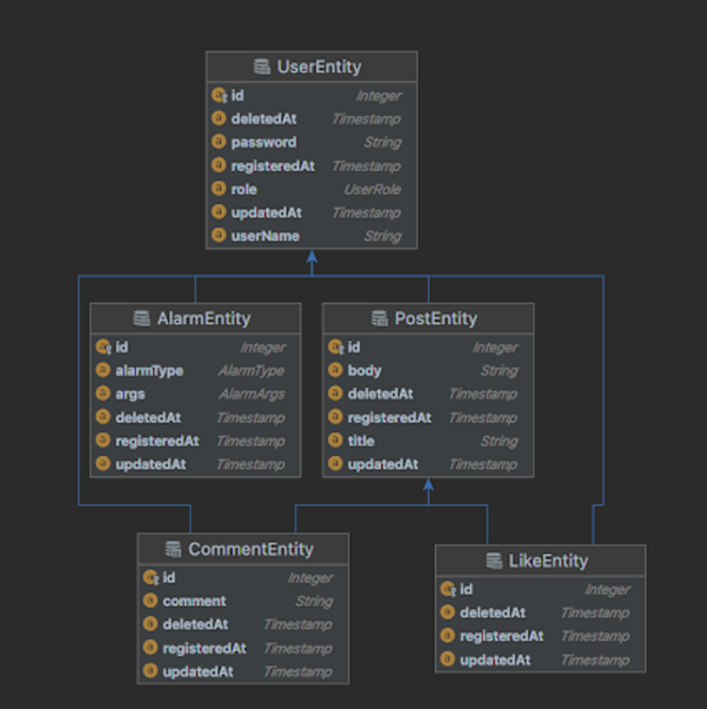

# LikeLionBackEndSchool2기
### 개인프로젝트

swagger 주소 : http://ec2-43-201-77-49.ap-northeast-2.compute.amazonaws.com:8080/swagger-ui/#/
---

# API 명세서
| Index | Method | URI                 | Description        |
|-------|--------|---------------------|--------------------|
| 1     | GET    | /api/v1/hello       | CI/CD 를 위한 TEST API |
| 2     | POST   | /api/v1/posts       | 글 작성               |
| 3     | GET    | /api/v1/posts/{id}  | 글 조회               |
| 4     | DELETE | /api/v1/posts/{id}  | 글 삭제               |
| 5     | POST   | /api/v1/users/join  | 회원가입               |
| 6     | POST   | /api/v1/users/login | 로그인                |
| 7     | PUT    | /api/v1/posts/{id}  | 글 수정 (개발예정)        |
| 8     | GET    | /api/v1/posts       | 글 전체 조회 (개발예정)     |

---

## 개발환경

---

- 에디터 : Intellij Ultimate
- 개발 툴 : SpringBoot 2.7.5
- 자바 : JAVA 11
- 빌드 : Gradle 6.8
- 서버 : AWS EC2
- 배포 : Docker
- 데이터베이스 : MySql 8.0
- 필수 라이브러리 : SpringBoot Web, MySQL, Spring Data JPA, Lombok, Spring Security

## **sns_project 서비스 소개**

---

### 1️⃣ **회원 인증·인가**

- 모든 회원은 회원가입을 통해 회원이 됩니다.
- 로그인을 하지 않으면 SNS 기능 중 피드를 보는 기능만 가능합니다.
- 로그인한 회원은 글쓰기, 수정, 댓글, 좋아요, 알림 기능이 가능합니다.

### 2️⃣ 글쓰기

- 포스트를 쓰려면 회원가입 후 로그인(Token받기)을 해야 합니다.
- 포스트의 길이는 총 300자 이상을 넘을 수 없습니다.
- 포스트의 한 페이지는 20개씩 보이고 총 몇 개의 페이지인지 표시가 됩니다.
- 로그인 하지 않아도 글 목록을 조회 할 수 있습니다.
- 수정 기능은 글을 쓴 회원만이 권한을 가집니다.
- 포스트의 삭제 기능은 글을 쓴 회원만이 권한을 가집니다.

### 3️⃣ 피드

- 로그인 한 회원은 자신이 작성한 글 목록을 볼 수 있습니다.

### 4️⃣ 댓글

- 댓글은 회원만이 권한을 가집니다.
- 글의 길이는 총 100자 이상을 넘을 수 없습니다.
- 회원은 다수의 댓글을 달 수 있습니다.

### 5️⃣ 좋아요

- 좋아요는 회원만 권한을 가집니다.
- 좋아요 기능은 취소가 가능합니다.

### 6️⃣ 알림

- 알림은 회원이 자신이 쓴 글에 대해 다른회원의 댓글을 올리거나 좋아요시 받는 기능입니다.
- 알림 목록에서 자신이 쓴 글에 달린 댓글과 좋아요를 확인할 수 있습니다.

# Architecture(아키텍처)

- 각 단에 데이터를 전달 받을시 DTO 형태로 전달합니다.

# ERD

--
## 특이사항
    1.postController에서 list조회기능과 수정기능을 완성하지 못하였다.
    2.post에 현재 user정보를 담는 기능을 아직 완성하지 못하였다. 

## 접근방법
    1. 최대한 Service 계층에서 로직이 수행되려고 노력을 하였다.
    2. 